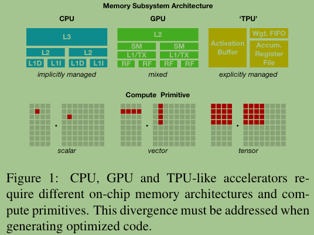

# TVM: An Automated End-to-End Optimizing Compiler for Deep Learning

In this paper, the authors summerize their work as TVM, a compiler that can handle graph-level and operator-level optimizations to provide performance portability to deep learning workloads across diverse hardware back-ends.

Goal:Perform more flexible optimization and generate hardware-specific optimized code for backends, e.g., CPUs, GPUs, and FPGA-based specialized accelerators.

## Why do we need AI compiler

- Diversity of hardware characteristics, including CPUs, GPUs, FPGAs, and ASICs. These hardware targets diverge in terms of memory organization, compute functional units, etc..

- Current DL frameworks, such as TensorFlow, MXNet, Caffe, and PyTorch, rely on a computational graph intermediate representation(IR) to implement optimizations. Graph-level optimizations are too high-level to handle some hardware back-end-specific operator-level transformations.

- To enable both graph- and operator-level optimization.

- Follow the design of specific hardware features.

- Large search space for optimization.

## Three key modules of TVM works
- Tensor Expression
    - To build operators and program transformation primitives that help various programs and optimizations.
- Automated program optimization framework
- Graph rewriter (automatic code generator)

