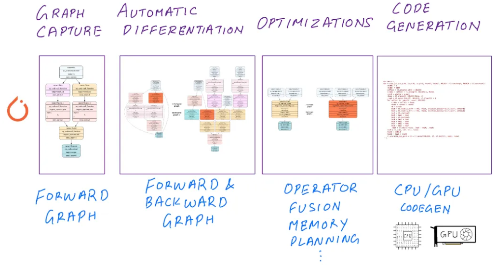
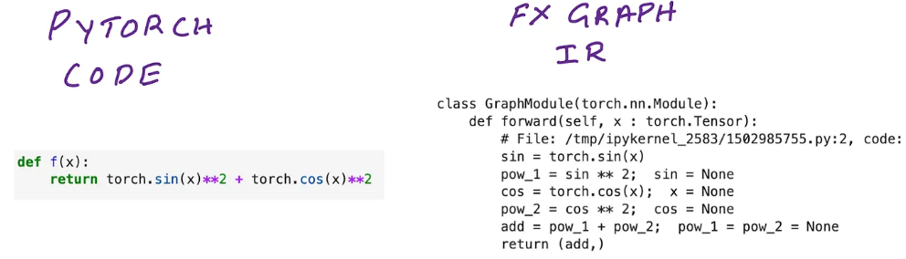
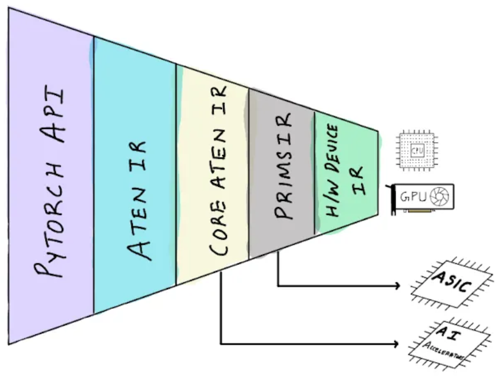

## [torch.compile](https://pytorch.org/tutorials/intermediate/torch_compile_tutorial.html#id3)

### [At a high-level the default options for PyTorch 2.0 deep learning compiler performs the following key tasks:](https://towardsdatascience.com/how-pytorch-2-0-accelerates-deep-learning-with-operator-fusion-and-cpu-gpu-code-generation-35132a85bd26)
- Graph capture: Computational graph representation for your models and functions. PyTorch technologies: TorchDynamo, Torch FX, FX IR
- Automatic differentiation: Backward graph tracing using automatic differentiation and lowering to primitives operators. PyTorch technologies: AOTAutograd, Aten IR
- Optimizations: Forward and backward graph-level optimizations and operator fusion. PyTorch technologies: TorchInductor (default) or other compilers
- Code generation: Generating hardware specific C++/GPU Code. PyTorch technologies: TorchInductor, OpenAI Triton (default) other compilers

### TorchDynamo
 **TorchDynamo** is responsible for JIT compiling arbitrary Python code into [FX graphs](https://pytorch.org/docs/stable/fx.html#torch.fx.Graph), which can then be further optimized. TorchDynamo extracts FX graphs by analyzing Python bytecode during runtime and detecting calls to PyTorch operations. 

**TorchInductor** further compiles the FX graphs into optimized kernels, but TorchDynamo allows for different backends to be used.

### TorchInductor
**TorchInductor** is the default optimizing compiler with torch.compile() that can generate optimized kernels for GPUs using OpenAI Triton and CPUs using OpenMP pragma directives.

Under the hood, for GPU targets, TorchInductor uses OpenAI’s Triton to generate fused GPU kernels. Triton itself is a separate Python based framework and compiler for writing optimized low-level GPU code which is otherwise written in CUDA C/C++. But the only difference is that TorchInductor will generate Triton code which is compiled into low level PTX code.

### IR
- ATen IR is a list of operators supported by the ATen library. you can see the full list of operations implemented in ATen library [here](https://pytorch.org/cppdocs/api/namespace_at.html). 
- Core Aten IR (formerly canonical Aten IR) is a subset of the Aten IR that can be used to compose all other operators in the Aten IR. 
- Prims IR is an even smaller subset of the Core Aten IR that further decomposes Core Aten IR ops into fundamental operations making it even easier for compilers that target specific hardware to support PyTorch.

If you’re designing hardware or hardware compilers, it’d be near impossible to support the full list of PyTorch API in hardware, what you can do is build a compiler that only supports the smaller subset of fundamental operators defined in Core Aten IR or Prims IR, and let AOTAutograd decompose compound operators into the core operators