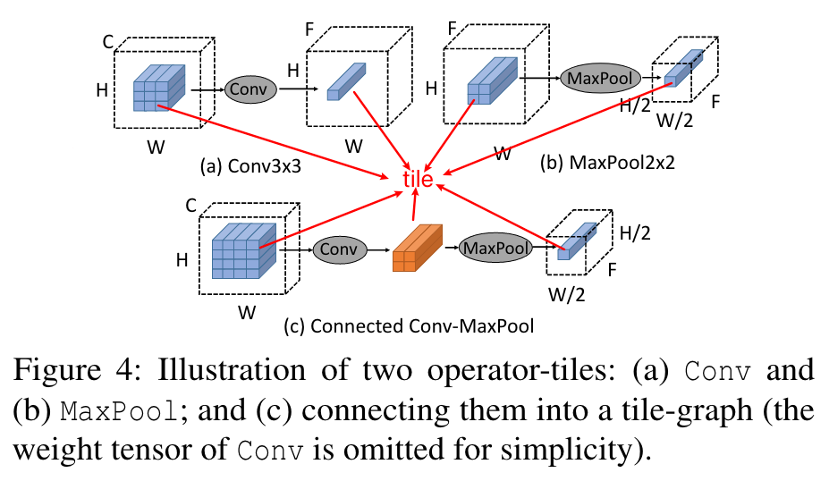
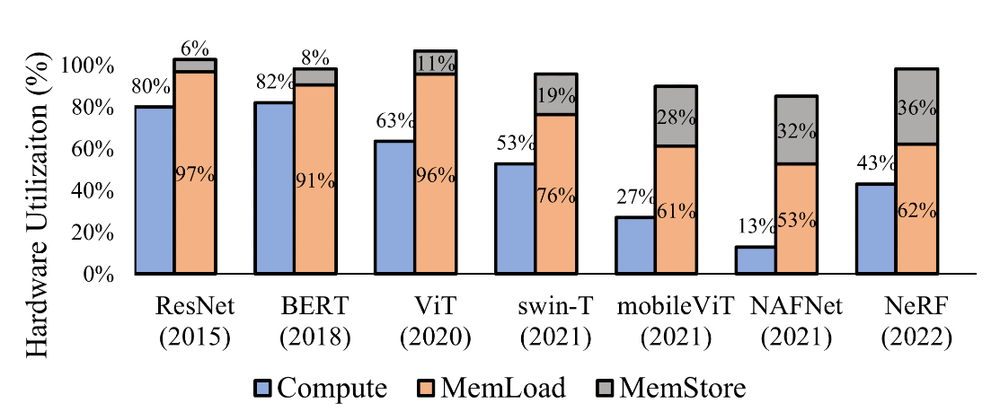
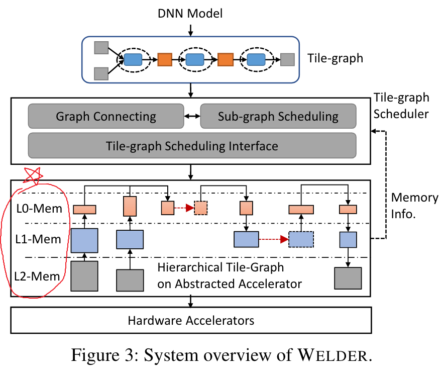
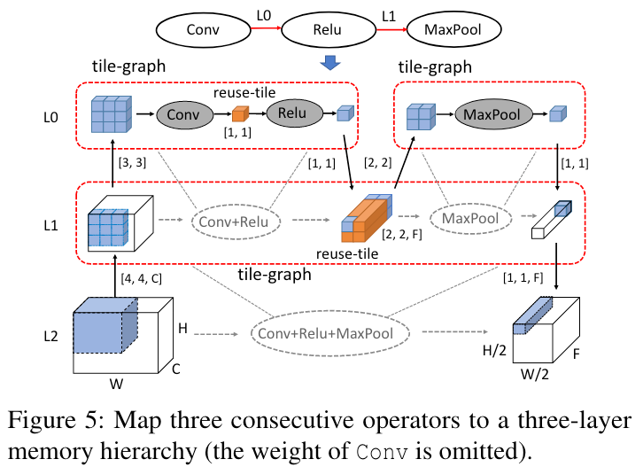
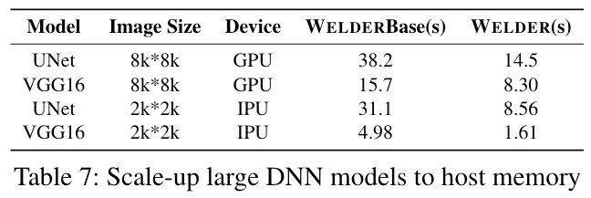

# WELDER: Scheduling Deep Learning Memory Access via Tile-graph

WELDER is a deep learning compiler that holistically optimizes memory access for end-to-end DNN models consisting of general operators.

Two most important conceptions that used to guide the design of Welder:
- *Tile-graph*: break down the computation of operators. 

- *Memory trafic*: if the tile graph is determined, the memory trafic can be calculated.

## Motivation
1. Modern DNNs are memory-bounded.

2. Conflicted intra- and inter-operator data reuse patterns.
>When the two operators are optimized independently, their optimal tile sizes in shared memory are different, e.g., [32×64] for Matmul and [4×128] for Softmax.

## Welder overview

1. Welder takes a full DNN model as input and converts it into a data-flow graph of tile-based computing tasks (i.e., operator-tiles), which is called tilegraph.
2. WELDER uses a "first-connect-then-schedule" method:
    - Connect: It assumes adjacent operators can reuse data tiles at a specific memory layer.
    - Schedule: It then determines the optimal common tile shape.
    - Evaluate: It checks if this arrangement reduces overall memory traffic.
3. You have to note that *L0, L1 and L2*-Mem in the figure is not the Cache of GPU, it means the *level 0, level 1 and level 2* that abstracted from Welder. I may say *L0 = register level*, *L1 = shared memory* and *L2 = other memory*, this paper mentioned only to manage the register and shared memory.

## Tile-graph

- *operator-tile*: The whole fined-gained task(could be (fused)operator).
- *reuse-tile*: The data could be reused like operator fusion.
- *tile-graph*: The dataflow on different memory hierarchy.

1. *Tile propagation.*
Most tiles which can be automatically inferred by propagating an output tile shape to the entire graph.
2. *Memory traffic and footprint.*
After the tile propagation, the memory traffic and footprint of a tile-graph can be determined.

## Scale-up with Host Memory

- WELDER’s abstracted device layer allows us to extend the memory hierarchy to support large DNN tasks.

- When a single tensor from some layers is often too large to fit in the GPU memory.

    >WELDER addresses this issue by generating a tile-based execution plan on the extended memory hierarchy through holistic traffic optimization. This approach allows us to load a data tile from the host memory, compute several connected operator tiles by reusing the data in device memory, and store the result back, as if it was being processed on a single device.

## Design and Implementation

1. Tile-graph Scheduling.

keywords: operators, recusively partition, traverse.
>To map a DNN model represented by an inital data flow graph to an accelerator, we can recursively partition each operator into multiple operator-tiles to fit within each memory layer, and connect operator-tiles at higher memory layers to exploit inter-operator data reuse. As a result, an entire DNN computation can be modeled as a data streaming pipeline over a two-dimensional space, with data tiles moving up and down the memory hierarchy vertically and being passed to successor operators at different layers horizontally.

2. Mapping to Hardware Accelerator.

>WELDER provides an abstracted accelerator device with hierarchical memory layers. The memory configurations, such as the number of layers, memory capacity, and transaction width of each layer, can be obtained through a MemLevels interface

3. Hardware-aligned Tile Search
    - Enumerate efficient data tile size.
    - Decide aligned computation parallelism.
    - Support TensorCore.

4. Code Generation and Compilation
    - Load/store rewriting.
    - Block/thread index remapping.
    - Memory management.
    - Compilation speedup.