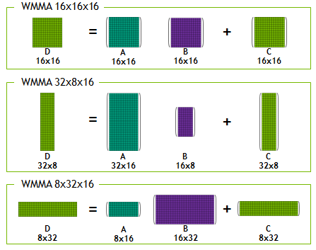

## [CUDA graphs](https://developer.nvidia.com/blog/cuda-graphs/)
> There are overheads associated with the submission of each operation to the GPU – also at the microsecond scale – which are now becoming significant in an increasing number of cases. 

Turing includes Tensor Cores, which are specialized hardware units designed for performing mixed precision matrix computations commonly used in deep learning neural network training and inference applications.

In Turing, each Tensor Core can perform up to 64 floating point fused multiply-add (FMA) operations per clock using FP16 inputs.

CUDA C++ makes Tensor Cores available via the Warp-Level Matrix Operations (WMMA) API. At the CUDA level, the warp-level interface addresses 16×16, 32×8 and 8×32 size matrices by spanning all 32 threads of the warp.

## [CUDA and Pytorch](https://pytorch.org/docs/stable/notes/cuda.html)

## Memory Management

The default cuBLAS workspace size for sm<90 uses **8.125MB** and is initialized: [see ref.](https://discuss.pytorch.org/t/help-with-cuda-memory-allocation-during-forward-linear/190797)

[Pytorch memory management](https://pytorch.org/docs/stable/notes/cuda.html#memory-management):

- PyTorch uses a *caching memory allocator* to speed up memory allocations. This allows fast memory deallocation without device synchronizations.
-
