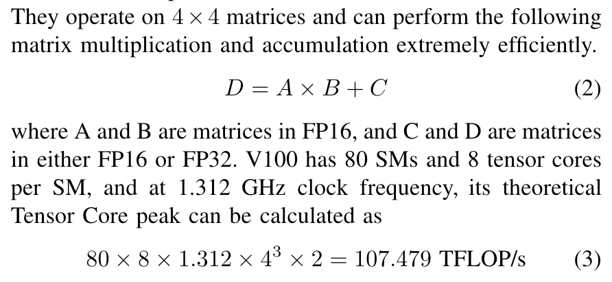

## Some terms of GPU

# TODO
- **GPU Utilization**: 
- **Architecture**: 
  - **Turing**: 
  - **Ampere**: 
  - **Hopper**: 
  - **Tensor cores**: That are useful for accelerating matrix multiplication operations.
  
- **Computation**: 
  - **FP32**:
  - **TF32**:
- **Arithmetic intensity**: Also know as computational intensity, is the ratio of the number of arithmetic operations to the number of data movements.

- **Thread**: 
  - GPU threads take very few clock cycles to generate and schedule, while CPU threads take thousands of clock cycles.
- **Block**: 
  - Blockdim: <<<x, y, z>>>, The choice of dimensionality for organizing threads usually reflects the dimensionality of the data. For example, if the data is a vector has 1 dimension, then the blockdim is better to be <<<x, 1, 1>>>. In general, it is recommended that the number of threads in each dimension of a thread block be a multiple of 32 for hardware efficiency reasons.
- **Grid**: 
  - All threads in a grid execute the same kernel function.
- **Warp**: 
  - In most implementations to date, once a block has been assigned to an SM, it is further divided into 32-thread units called warps.
  - Control divergence: When threads within a warp take different control flow paths, the SIMD hardware will take multiple passes through these paths, one pass for each path. During each pass, the threads that follow the other path are not allowed to take effect.

### GPU Memory Hierarchy

    
    

1. **Registers**
   - Private to each thread
   - Not visible to other threads
   - Allocation managed by compiler

2. **L1/Shared Memory (SMEM)**
   - Fast, on-chip scratchpad memory
   - Can be used as L1 cache and shared memory
   - Shared by:
     - All threads within a CUDA block
     - All CUDA blocks running on the same SM

3. **Read-only Memory**
   - Each SM contains:
     - Instruction cache
     - Constant memory
     - Texture memory
     - RO cache
   - Read-only access from kernel code

4. **L2 Cache**
   - Shared across all SMs
   - Accessible by all threads in all CUDA blocks
   - Size comparison:
     - A100 GPU: 40 MB
     - V100 GPU: 6 MB

5. **Global Memory**
   - GPU's main DRAM
   - Also known as framebuffer
   - Largest but slowest memory type

## [CUDA graphs](https://developer.nvidia.com/blog/cuda-graphs/)
> There are overheads associated with the submission of each operation to the GPU – also at the microsecond scale – which are now becoming significant in an increasing number of cases. 

Turing includes Tensor Cores, which are specialized hardware units designed for performing mixed precision matrix computations commonly used in deep learning neural network training and inference applications.

In Turing, each Tensor Core can perform up to 64 floating point fused multiply-add (FMA) operations per clock using FP16 inputs.

CUDA C++ makes Tensor Cores available via the Warp-Level Matrix Operations (WMMA) API. At the CUDA level, the warp-level interface addresses 16×16, 32×8 and 8×32 size matrices by spanning all 32 threads of the warp.

## [CUDA and Pytorch](https://pytorch.org/docs/stable/notes/cuda.html)

## Memory Management

The default cuBLAS workspace size for sm<90 uses **8.125MB** and is initialized: [see ref.](https://discuss.pytorch.org/t/help-with-cuda-memory-allocation-during-forward-linear/190797)

[Pytorch memory management](https://pytorch.org/docs/stable/notes/cuda.html#memory-management):

- PyTorch uses a *caching memory allocator* to speed up memory allocations. This allows fast memory deallocation without device synchronizations.
-

## References

- https://arthurchiao.art/blog/gpu-data-sheets/