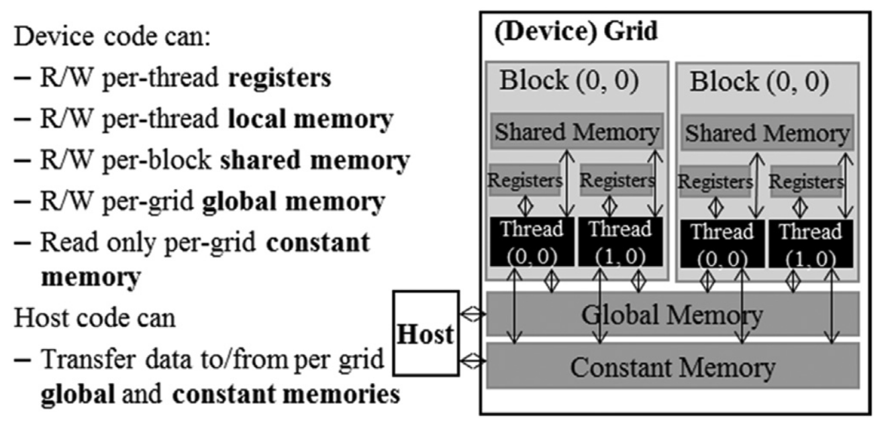
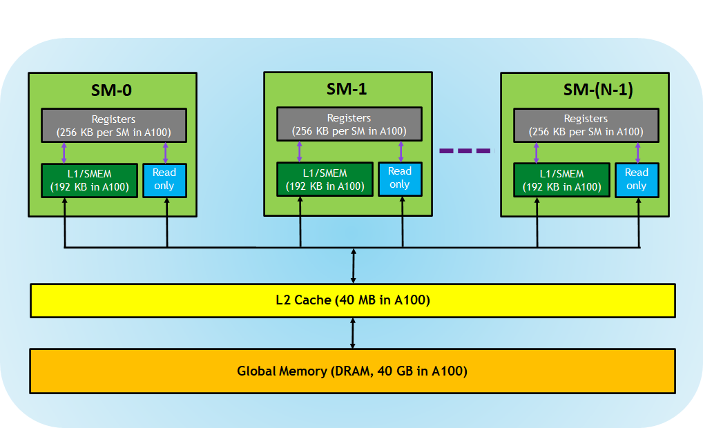
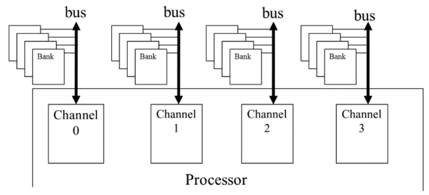
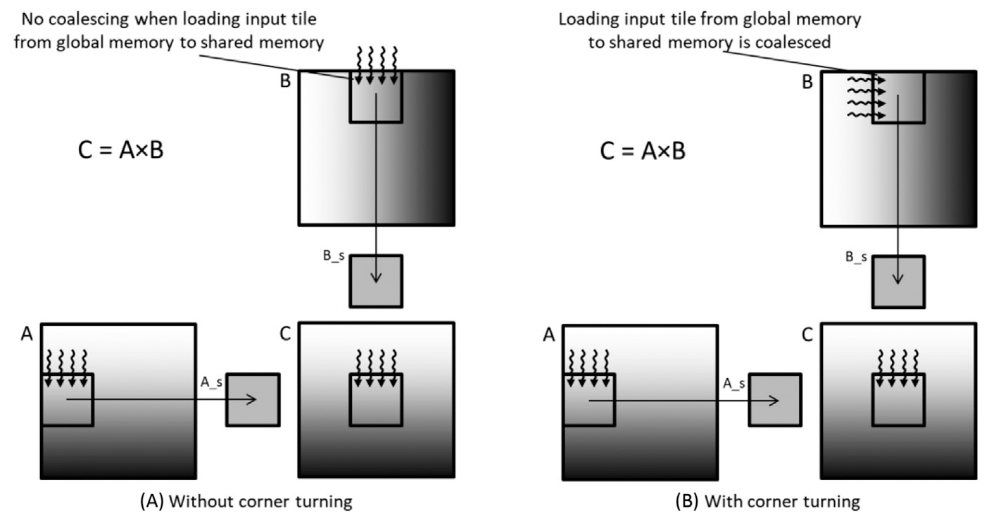
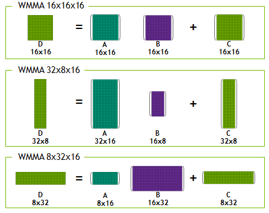

# Table of Contents
- [Some terms of GPU](#some-terms-of-gpu)
  - [GPU Utilization](#gpu-utilization)
  - [Architecture](#architecture)
  - [Computation](#computation)
  - [Arithmetic intensity](#arithmetic-intensity)
  - [Thread](#thread)
  - [Block](#block)
  - [Grid](#grid)
  - [Warp](#warp)
  - [Occupancy](#occupancy)
- [GPU Memory Hierarchy](#gpu-memory-hierarchy)
  - [Registers](#registers)
  - [L1/Shared Memory (SMEM)](#l1shared-memory-smem)
  - [Read-only Memory](#read-only-memory)
  - [L2 Cache](#l2-cache)
  - [Global Memory](#global-memory)
  - [Local Memory](#local-memory)
- [Multi-process Service(MPS)](#multi-process-service)
- [CUDA graphs](#cuda-graphs)
- [CUDA and Pytorch](#cuda-and-pytorch)
- [Memory Management](#memory-management)
- [Profiling tools](#profiling-tools)
- [References](#references)

## Some terms of GPU

# TODO
- **GPU Utilization**: 
- **Architecture**: 
  - **Turing**: 
  - **Ampere**: 
  - **Hopper**: 
  - **Tensor cores**: That are useful for accelerating matrix multiplication operations.
    >They operate on 4×4 matrices and can perform the following matrix multiplication and accumulation extremely efficiently.
    >$D = A \times B + C$
    >where A and B are matrices in FP16, and C and D are matrices in either FP16 or FP32. V100 has 80 SMs and 8 tensor cores per SM, and at 1.312 GHz clock frequency, its theoretical Tensor Core peak can be calculated as
    >$80 \times 8 \times 1.312 \times 4^3 \times 2 = 107.479$ TFLOP/s (3)
- **Computation**: 
  - **FP32**:
  - **TF32**:
- **Arithmetic intensity**: Also know as computational intensity, is the ratio of the number of arithmetic operations to the number of data movements.

- **Thread**: 
  - GPU threads take very few clock cycles to generate and schedule, while CPU threads take thousands of clock cycles.
  - Threads, Context-switching, and Zero-overhead Scheduling:
    >GPU SMs achieves zero-overhead scheduling by holding all the execution states for the assigned warps in the hardware registers so there is no need to save and restore states when switching from one warp to another.
  - [How many thread are executed at the same time ?](https://forums.developer.nvidia.com/t/how-many-thread-are-executed-at-the-same-time/52972)
- **Block**: 
  - Blockdim: <<<x, y, z>>>, The choice of dimensionality for organizing threads usually reflects the dimensionality of the data. For example, if the data is a vector has 1 dimension, then the blockdim is better to be <<<x, 1, 1>>>. In general, it is recommended that the number of threads in each dimension of a thread block be a multiple of 32 for hardware efficiency reasons.
- **Grid**: 
  - All threads in a grid execute the same kernel function.
- **Warp**: 
  - In most implementations to date, once a block has been assigned to an SM, it is further divided into 32-thread units called warps.
  - Control divergence: When threads within a warp take different control flow paths, the SIMD hardware will take multiple passes through these paths, one pass for each path. During each pass, the threads that follow the other path are not allowed to take effect.
  - Latency tolerance/hiding:
    >That is, each SM has only enough execution units to execute a subset of all the threads assigned to it at any point in time. In earlier GPU designs, each SM can execute only one instruction for a single warp at any given instant. In more recent designs, each SM can execute instructions for a small number of warps at any given point in time. In either case, the hardware can execute instructions only for a subset of all warps in the SM. A legitimate question is why we need to have so many warps assigned to an SM if it can execute only a subset of them at any instant? The answer is that this is how GPUs tolerate long-latency operations such as global memory accesses. When an instruction to be executed by a warp needs to wait for the result of a previously initiated long-latency operation, the warp is not selected for execution. Instead, another resident warp that is no longer waiting for results of previous instructions will be selected for execution. If more than one warp is ready for execution, a priority mechanism is used to select one for execution. This mechanism of filling the latency time of operations from some threads with work from other threads is often called “latency tolerance” or “latency hiding” (see the “Latency Tolerance” sidebar).

- **Occupancy**: The ratio of the number of warps assigned to an SM to the maximum number it supports.

### GPU Memory Hierarchy

    
    

1. **Registers**
   - Private to each thread
   - Not visible to other threads
   - Allocation managed by compiler

2. **L1/Shared Memory (SMEM)**
   - Fast, on-chip scratchpad memory
   - Can be used as L1 cache and shared memory
   - Shared by:
     - All threads within a CUDA block
     - All CUDA blocks running on the same SM

3. **Read-only Memory**
   - Each SM contains:
     - Instruction cache
     - Constant memory
     - Texture memory
     - RO cache
   - Read-only access from kernel code

4. **L2 Cache**
   - Shared across all SMs
   - Accessible by all threads in all CUDA blocks
   - Size comparison:
     - A100 GPU: 40 MB
     - V100 GPU: 6 MB

5. **Global Memory**: Global memory is a 49-bit virtual address space that is mapped to physical memory on the device, pinned system memory, or peer memory. Global memory is visible to all threads in the GPU. Global memory is accessed through the SM L1 and GPU L2.
   - GPU's main DRAM: DRAM systems typically employ two more forms of parallel organization: banks and channels. At the highest level, a processor contains one or more channels.

   - 
   
   - Also known as framebuffer
   - Largest but slowest memory type
   - Double data rate (DDR) busses perform two data transfers per clock cycle: one at the rising edge and one at the falling edge of each clock cycle.

6. **Local Memory**
   - Placed in global memory
   - Not shared across threads.
   - It places data that is private to the thread but cannot be allocated in registers. This data includes statically allocated arrays, spilled registers, and other elements of the thread’s call stack.

## Performance Considerations

1. **Memory Coalescing**: Memory coalescing is the process of combining multiple memory accesses into a single memory access. Background: row-major and column-major layour. Terms: corner-turn...\

2. **Hiding memory latency**: Memory Bank and Channel. double data rate (DDR). interleaved data distribution.

2. **Threading Coarsening**: Assigning each thread multiple units of work.
   
## [Multi-process Service](https://www.hpcadmintech.com/wp-content/uploads/2016/03/Carlo_Nardone_presentation.pdf)
- Background:
  - Each process has a unique context.
  - Only a single context can be active on a device at a time.
  - Multiple processes (e.g. MPI) on a single GPU could not operate concurrently
- MPS: Software layer that sits between the driver and your application.
  - Routes all CUDA calls through a single context
  - Multiple processes can execute concurrently

## [CUDA graphs](https://developer.nvidia.com/blog/cuda-graphs/)
> There are overheads associated with the submission of each operation to the GPU – also at the microsecond scale – which are now becoming significant in an increasing number of cases. 

Turing includes Tensor Cores, which are specialized hardware units designed for performing mixed precision matrix computations commonly used in deep learning neural network training and inference applications.

In Turing, each Tensor Core can perform up to 64 floating point fused multiply-add (FMA) operations per clock using FP16 inputs.

CUDA C++ makes Tensor Cores available via the Warp-Level Matrix Operations (WMMA) API. At the CUDA level, the warp-level interface addresses 16×16, 32×8 and 8×32 size matrices by spanning all 32 threads of the warp.

## [CUDA and Pytorch](https://pytorch.org/docs/stable/notes/cuda.html)

## Memory Management

The default cuBLAS workspace size for sm<90 uses **8.125MB** and is initialized: [see ref.](https://discuss.pytorch.org/t/help-with-cuda-memory-allocation-during-forward-linear/190797)

[Pytorch memory management](https://pytorch.org/docs/stable/notes/cuda.html#memory-management):

- PyTorch uses a *caching memory allocator* to speed up memory allocations. This allows fast memory deallocation without device synchronizations.
-

## profiling tools
- Nsight Compute and Nsight Systems
  - https://docs.alcf.anl.gov/polaris/performance-tools/NVIDIA-Nsight/#nsight-compute
  - https://dev-discuss.pytorch.org/t/using-nsight-systems-to-profile-gpu-workload/59
  - https://docs.google.com/presentation/d/1vikeOOHF2ig15af2qQxtUG3KRDu9T973/edit#slide=id.p6
- Flops measurement:
  - https://www.deepspeed.ai/tutorials/flops-profiler/
## References

- https://arthurchiao.art/blog/gpu-data-sheets/