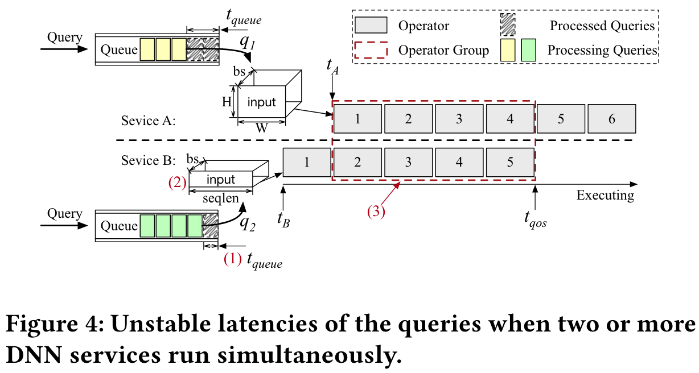
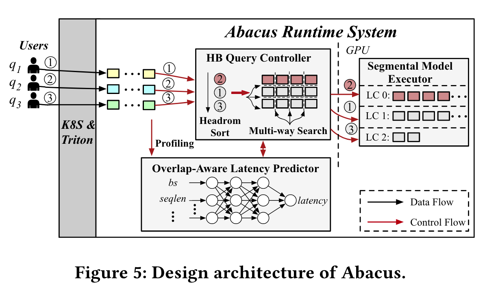

## Enable Simultaneous DNN Services Based on Deterministic Operator Overlap and Precise Latency Prediction

proposes a system named Abacus that allows multiple deep neural network (DNN) services to run simultaneously on GPUs with a focus on improving hardware utilization while maintaining low latency and meeting quality-of-service (QoS) requirements.

## Key concepts:

### 1 Challenges with Co-locating DNN Services on GPUs:

Typically, when running multiple DNN services on a single GPU, it leads to increased latency, which can be unstable and hard to predict. This instability comes from two main factors:
- Sensitivity of queries to input size and sequence length.
- Non-deterministic operator overlap, where the way different services use shared GPU resources is unpredictable.

### 2 Abacus System:
- **Operator Overlap**: Unlike previous solutions that run queries sequentially (First-Come-First-Serve, Shortest Job First, etc.), Abacus uses a deterministic operator overlap to control how DNN operators are scheduled and run simultaneously.
- **Latency Predictor**: Abacus includes a latency predictor that uses a machine learning model to predict how long it will take to process operators based on the overlap between them. This prediction allows it to avoid violating QoS targets.
- **Headroom-based Query Controller**: It manages the scheduling of queries based on how much "headroom" (time buffer) each query has before it violates its latency target.
- **Segmental Model Executor**: This ensures that operators run at the right time to maintain stable and predictable latency.

