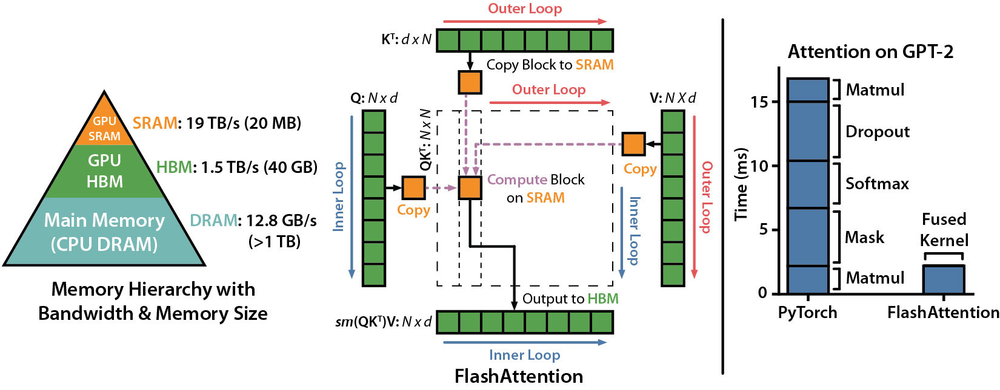
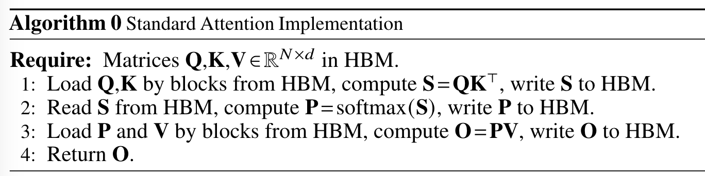
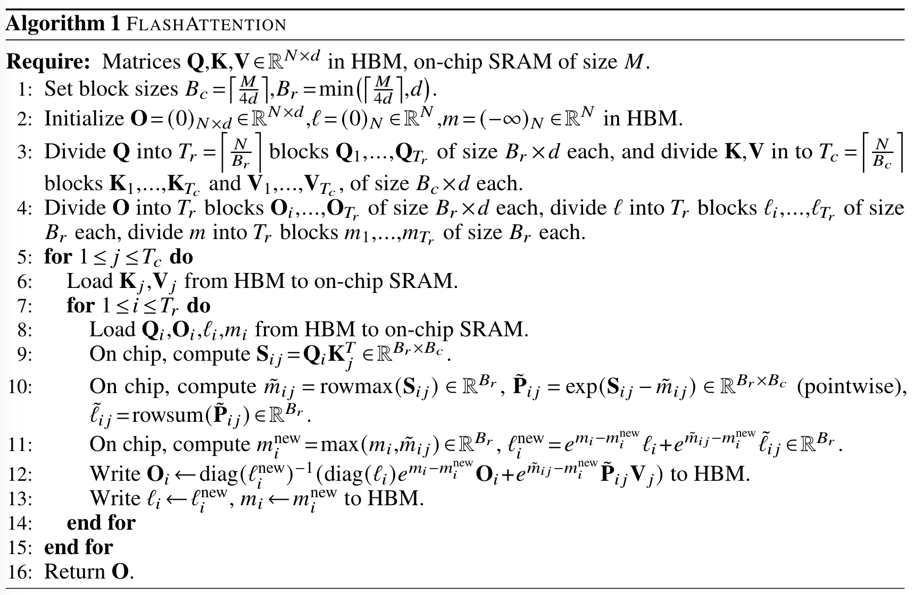

# FlashAttention

## FlashAttention-1: Fast and Memory-Efficient Exact Attention with IO-Awareness ([GitHub](https://github.com/Dao-AILab/flash-attention?tab=readme-ov-file)).
[Slides](./flash-attention-slides.pdf) from the presentation of the paper in ICML 2022.

### Introduction:
- Problem definition: Transformers are memory-hungry on long sequences.
- Bottleneck in attention computation: Reads and writes between levels of GPU memory.
- Traditional solutions: Approximate attention mechanisms.(often do not achieve wall-clock speedup)
- FlashAttention: An IO-aware attention algorithm that uses tiling to reduce the number of memory reads/writs between
GPU HBM and GPU SRAM.

1. Main goal: Main goal is to avoid reading and writing the attention matrix to and from HBM.
    - Implementation challenges:
        - Reduction of computing the softmax function.
        - Not storing large intermediate attention matrices for backward pass. 
    - Solutions:
        - Tiling: Restructuring attention computation.
        - Recomputation: Only store the softmax normalization factor.

2. Other contributions:
    - Proving that FlashAttention requires $O(N^2d^2M^{-1})$ HBM accesses where 𝑑 is the head dimension and 𝑀 is the size of SRAM, 
    original attention requires $Ω(Nd+N^2)$ HBM accesses.
    - FlashAttention can serve as a primitive for other (approximate) attention mechanisms.

### Standard Attention: 
- Given ipnut sequences $Q, K, V \in \mathbb{R}^{N \times d}$, the attention mechanism computes the attention matrix $O \in \mathbb{R}^{N \times N}$ as:
    $S = QK^T\in \mathbb{R}^{N \times N}$, $P = \text{softmax}(S) \in \mathbb{R}^{N \times N}$, $O = PV \in \mathbb{R}^{N \times d}$.
- Softmax(let's say x is a vector from one row of $P$):
    $\text{softmax}(x_i) = \frac{e^{x_i-max(x)}}{\sum_{j=1}^{N}e^{x_j-max(x)}}$
- Implementation:

### FlashAttention:
1. Tiling: Computing attention by blocks.
    - challenge: Softmax couples columns of K, (because of the $max(x)$).
    - Solution: 
        - decompose $x = [x^{(1)}, x^{(2)}]$
        - max(x) = max(max($x^{(1)}$), max($x^{(2)}$))
        - $f(x) = [e^{max(x^{(1)})-max(x)}f(x^{1}), e^{max(x^{(2)})-max(x)}f(x^{2})]$
        - $l(x) = \sum_{i=1}^{N}f(x)$ = $e^{max(x^{(1)})-max(x)}l(x^{(1)}) + e^{max(x^{(2)})-max(x)}l(x^{(2)})$
        - $\text{softmax}(x) = \frac{f(x)}{l(x)}$
    - Implementation: keep tack of extra statistics like $max(x), l(x)$.

2. Recomputation: Recompute the attention matrix $S$ and $P$.

3. Kernel fusion: Combine all the computation steps (matrix multiply, softmax, optionally masking and dropout, matrix multiply).

