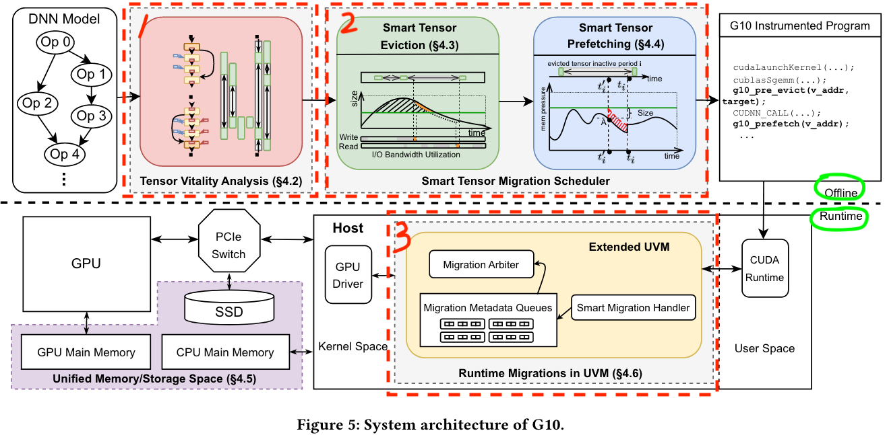
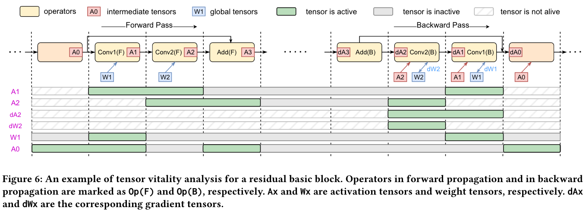
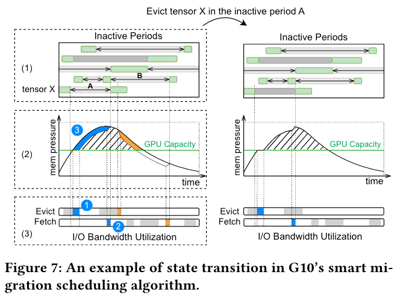
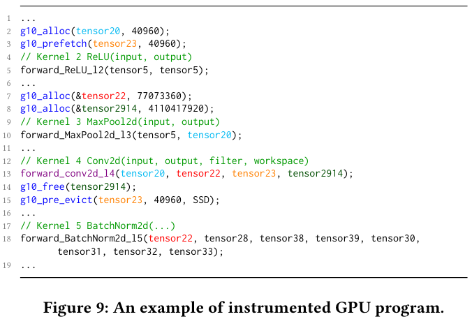

# G10: Enabling An Efficient Unified GPU Memory and Storage Architecture with Smart Tensor Migrations

## It has three major components: 
1. A tensor vitality analyzer that quantifies the *tensor size* and *liveness* as we compile a DNN model; 

2. A tensor migration scheduler for planning the *tensor migrations* (host<->GPU<->SSD) in advance; 

3. A *unified memory system* for simplifying GPU.

## 1. Tensor vitality analyzer
>Given a DNN model, G10’s tensor vitality analyzer will work with DNN compilers to track all the tensors and their dependencies, and quantify their sizes and lifetime (i.e., semantic knowledge of tensors).

### a. Identifying global tensors and intermediate tensors.
- *Global tensor*, such as model weights (e.g., W1) is used across multiple training iterations (will be used many times).
- *Intermediate tensor*, such as the activation and gradient (e.g., A1 and dA2), is used within one iteration (used only one time).

### b. Identifying tensor inactive time periods.
Status: *active*, *inactive*, *inactive time period*
>When an operator is being executed on GPU, both its input and output tensors are active, and should be present in GPU memory. Otherwise, a tensor is inactive. Inactive time period of a tensor as the period during which the tensor is inactive and not dead

## 2. Smart Tensor Eviction
The most beneficial tensor for offloading: large tensors with long inactive periods, etc.

If there are some other memory resources except host and GPU memory like SSD, G10 will consider the destination for tensors to offload based on the amount and bandwith.

G10 will select the best time to apply offloading **(How to control the offloading time is much complicated, because G10 select the time on the offline stage while the excution of GPU is dynamic, that means it's just an estimation time for the offloading.)**.

>G10 propose a smart eviction scheduling algorithm that iteratively finds the best eviction candidates (i.e., tensor inactive periods) in each training iteration at compile time. The algorithm tracks the GPU memory consumption and the migration bandwidth utilization to evaluate potential benefits of an eviction.

When does G10 evict: when the memory demands out of GPU capacity.

Metrice to select the evicting candidate: benefit-cost ratio: `3 / ( 1 + 2 )` (the number refers to the time labeled by blue tags in Figure 7).

## 3 Snapshot of implementation

G10 utilizes deep learning compilers to automatically insert the following instructions into the generated GPU program: 
- `g10_prefetch(vaddr, size)`, which fetches a tensor into GPU memory; 
- `g10_pre_evict (vaddr, size, target_loc)`, which evicts a tensor from GPU memory to the SSD or host memory; 
- `g10_alloc(**ptr, size)`, which allocates a buffer on the GPU memory asynchronously; 
- `g10_free(*ptr)`, which frees the buffer asynchronously.