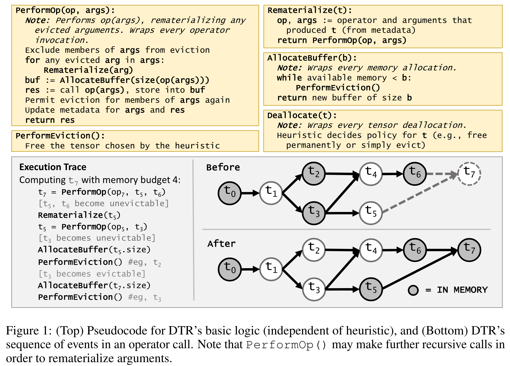

# DYNAMIC TENSOR REMATERIALIZATION

## Heuristics method are based on:
- staleness: s(t) the time since last use
- memory: m(t) the size of the tensor
- cost: c(t) the time required to compute t from its parent tensors
- goal: minimizing H(t) = c(t) /[s(t) * m(t)]

## terminology
- evict:
- checkpoint:
- rematerialize:
- banish:
- eager eviction:

## [CODE](https://github.com/uwsampl/dtr-prototype)