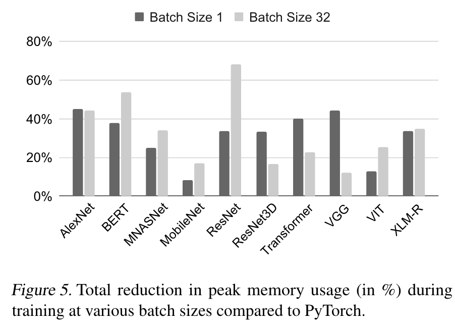
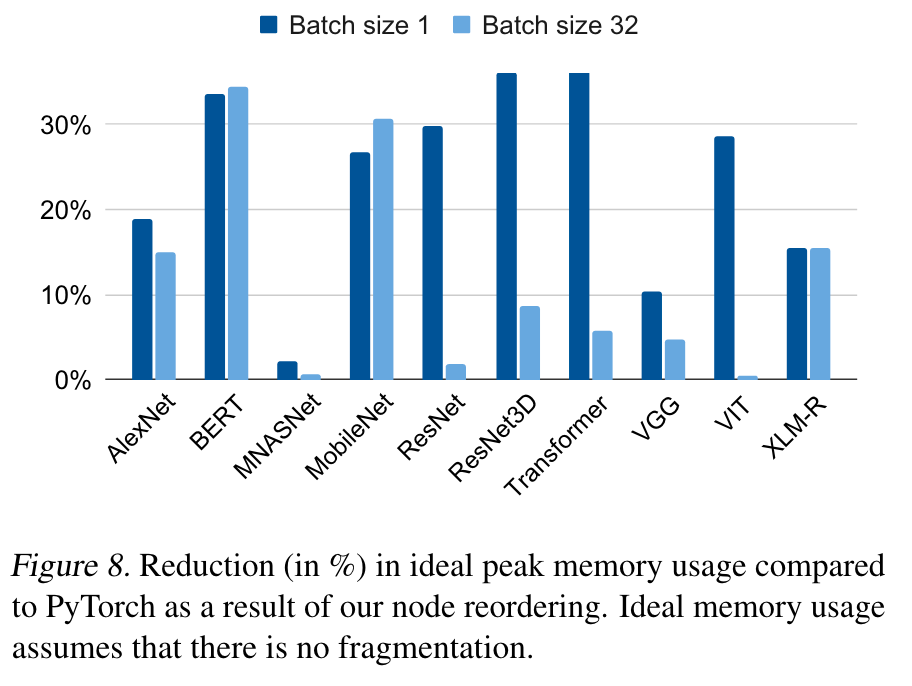

## MODeL: Memory Optimizations for Deep Learning

### Contributions:
1. Formulation of the problem: finding the lifetime and memory location of tensors that minimizes the peak memory required to train neural networks as a joint integer linear program.
2. Show how to simplify ILP formulations using domain knowledge, enabling off-the-shelf solvers to quickly reduce memory usage for large DNNs.
3. Study empirically the practicality and effectiveness of our solution on a wide variety of DNNs, which achieves average memory savings exceeding 30% in a median time of less than 7 seconds.
4. Open-source: https://github.com/facebookresearch/model_opt.

### Methods:
1. Operator reordering.
2. Memory layout optimization.

### results:

    
    

