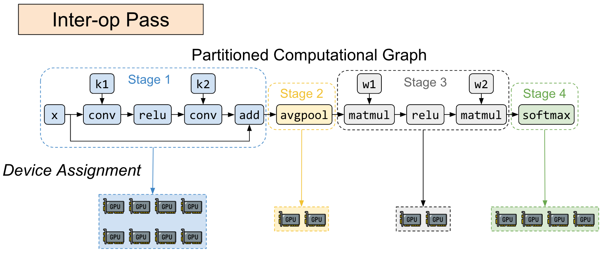

# Alpa: Automating Inter- and Intra-Operator Parallelism for Distributed Deep Learning

## [Code](https://github.com/alpa-projects/alpa?tab=readme-ov-file)

## [PDF, Slides, and Video](https://www.usenix.org/conference/osdi22/presentation/zheng-lianmin)

Core idea:

1. **Inter-operator parallelism**: 

2. **Intra-operator parallelism**:

