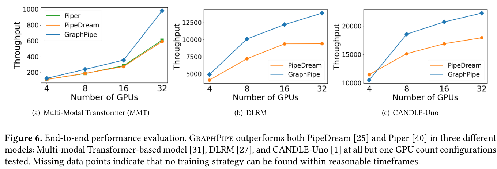

# GraphPipe: Improving Performance and Scalability of DNN Training with Graph Pipeline Parallelism

## Techniques:
1. Graphpipe is developed based on top of FlexFlow.

## Workloads
1. They explored three multi-branch DNNS
2. Multi-Modal Transformer-based model (MMT)
3. DLRM
4. CANDLE-Uno

## Comparision experiments:
1. PipeDream
2. Piper

