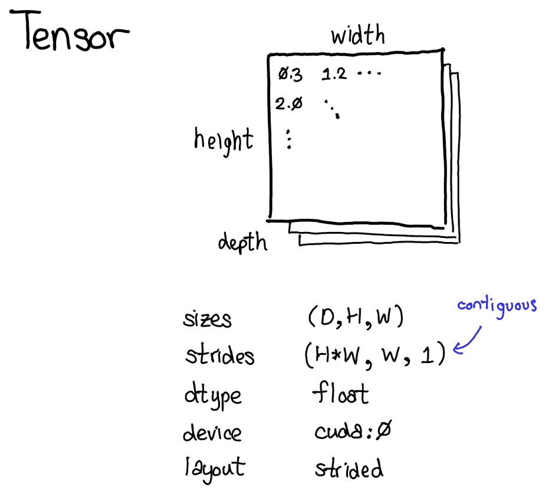
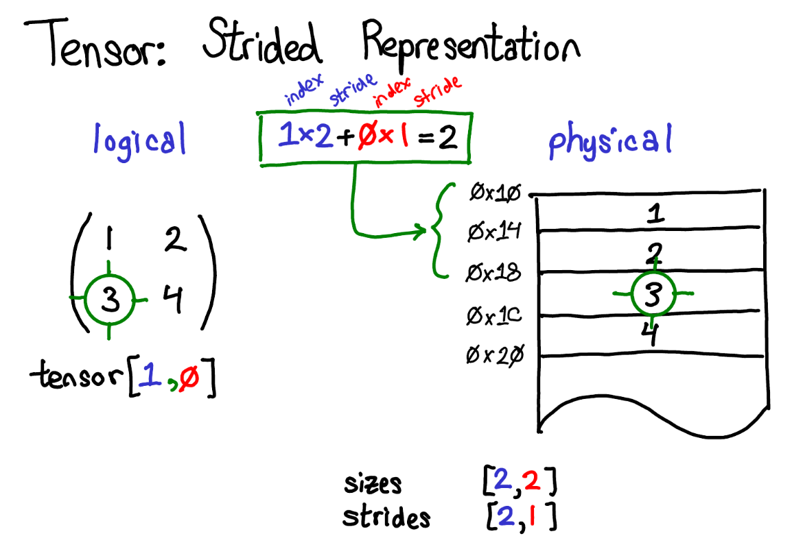
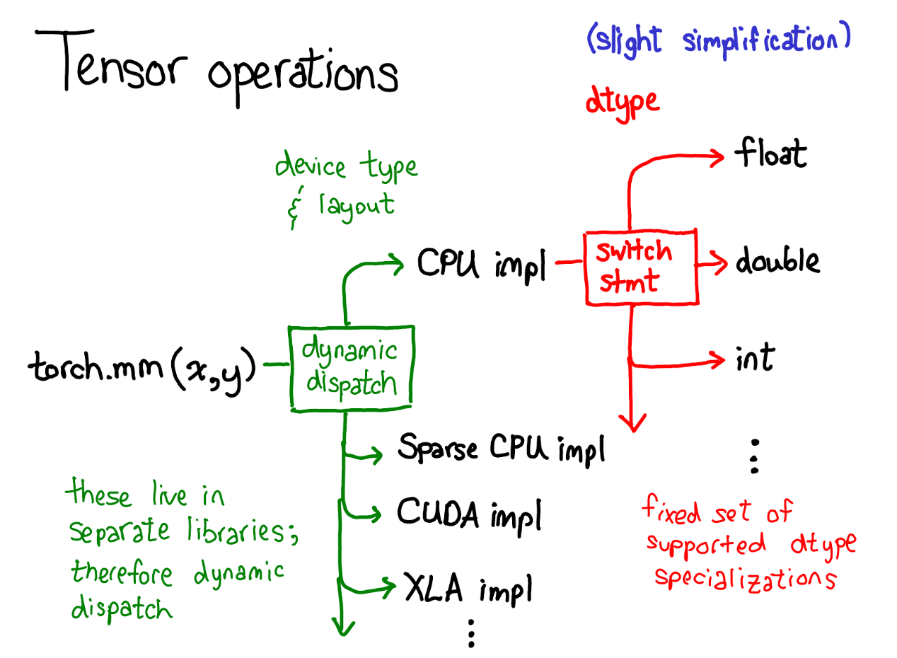
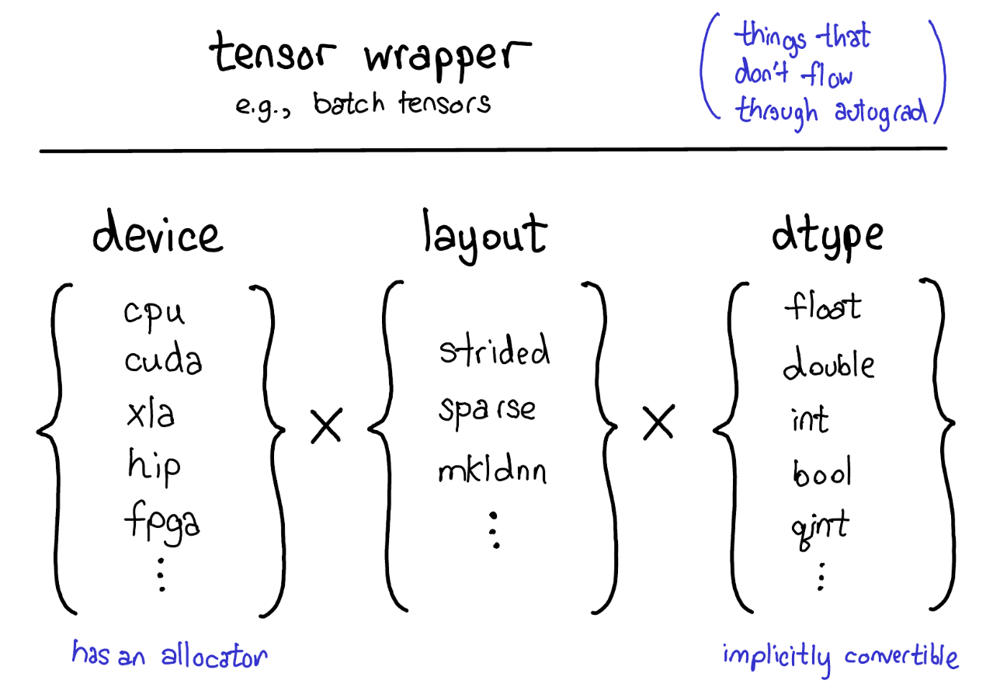
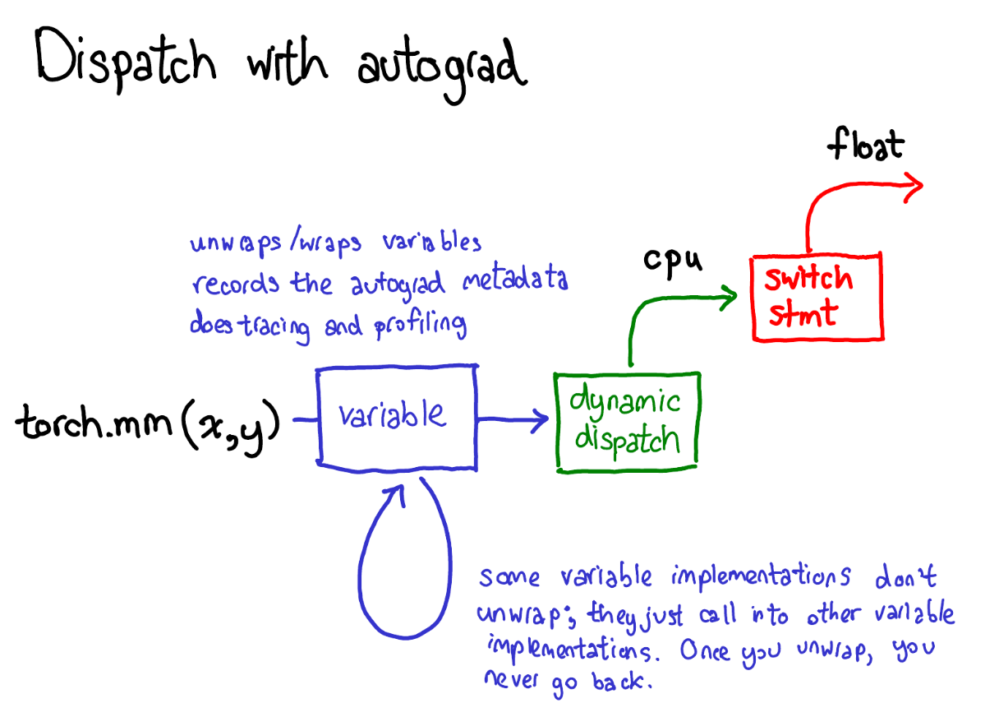
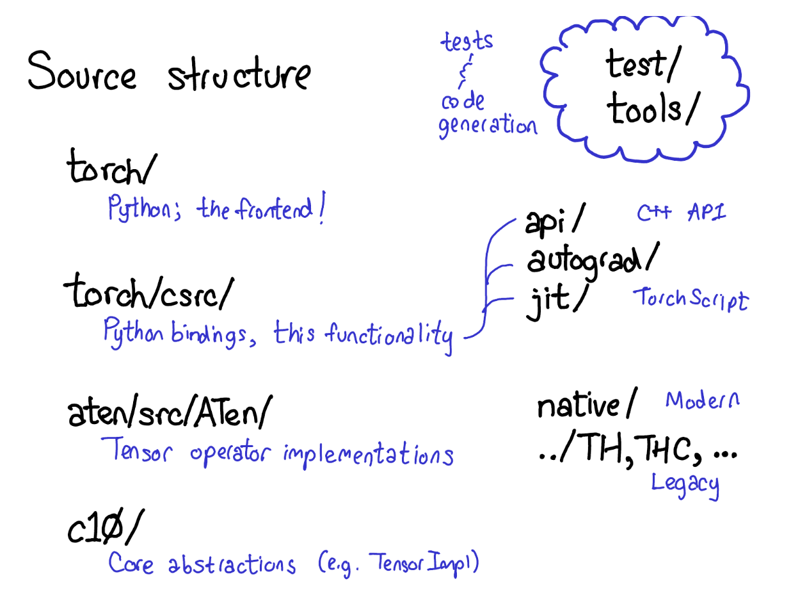
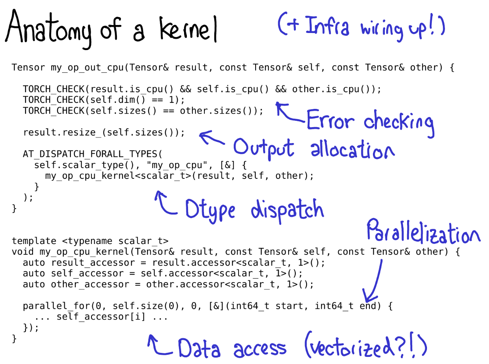

## [Pytorch Internals](http://blog.ezyang.com/2019/05/pytorch-internals)
- Tensor concepts
- Autograd


### Tensor

```
Tensor :
sizes (D, H, W)
strides (H*W, W, 1) # contiguous memory
dtype float
device CPU
layout torch.strided
```
<div style="display: flex; justify-content: space-between;">
    
    
</div>

#### Dispatches when computing tensor operations:

- The first dispatch is based on the device type and layout of a tensor.
- The second dispatch is based on the dtype of a tensor.

<div style="display: flex; justify-content: space-between;">
    
    
</div>

Don't be driven crazy be pytorch source code, what should be in your mind is that there are a lot of dispatches, the most call stacks are to determine which situation the tensor is in, and then call the corresponding function. You should just look through the code and understand the logic.

### Autograd

If you really want to understand the autograd, you should get familiar with [reverse-mode automatic differentiation](https://en.wikipedia.org/wiki/Automatic_differentiation#Reverse_accumulation) first.

If you understood the algorithm, you can still treat the autograd process of Pytorch as some dispatches.



### Pytorch Source Code

What you really need to focus on is these four directories:
- torch/: Python interface
- torch/csrc/: C++ implementation / binding code between Python and C++
- aten/: C++ implementation of tensor operations
- c10/: Core abstractions for tensor operations




### Write a new kernel

Steps:

- Kernel development involves metadata, 
- error checking, 
- tensor allocation, 
- dtype dispatch, 
- parallelization,
- computation.

