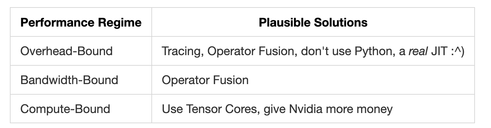
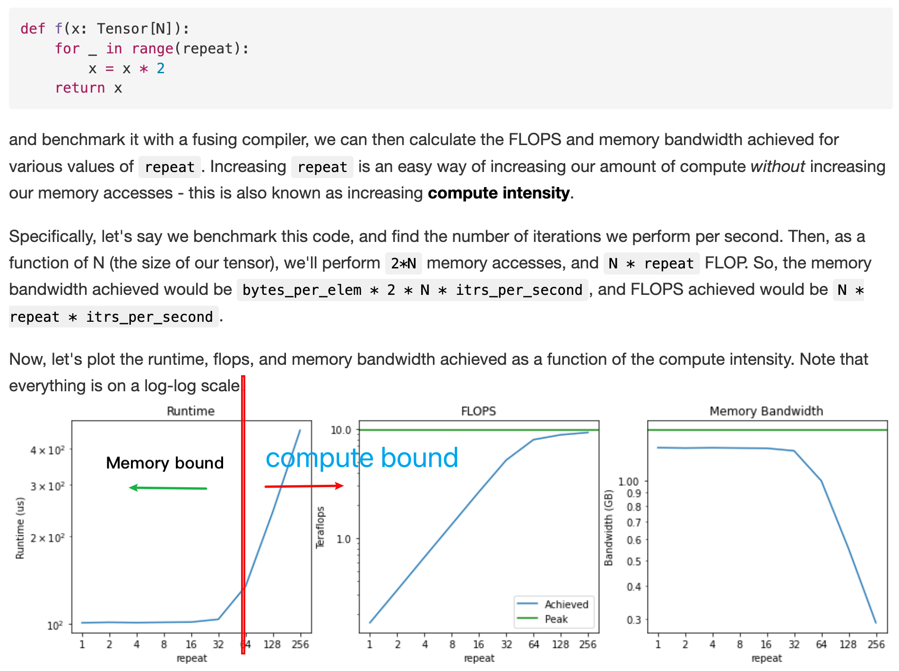

# Where does the time go when you are training a model?
- Computation: Operations that are performed on GPU.
- Memory access: Read and write to memory.
- Overhead: Everything else(launching kernels, synchronization, etc.)

## Memory bound(memory bandwidth bound) or compute bound?

1. https://horace.io/brrr_intro.html
2. https://www.thonking.ai/