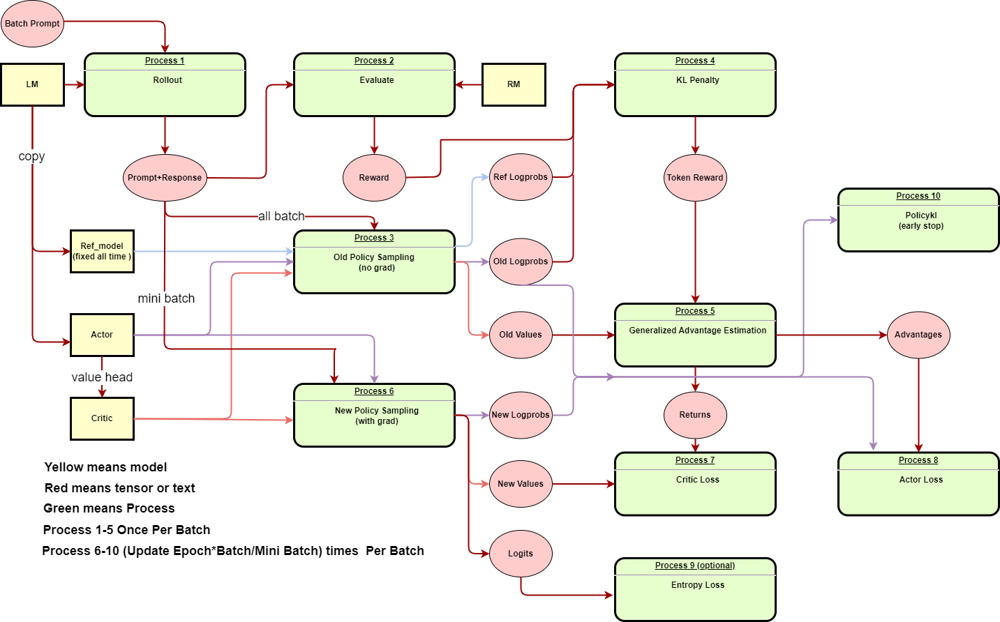

# Verl 

verl is an open source implementation of the paper [HybridFlow](https://arxiv.org/abs/2409.19256v2) and [code](https://github.com/volcengine/verl). verl is a flexible and efficient RLHF library for LLMs.

verl represents RLHF as a dataflow graph. Take the PPO algorithm as an example, the dataflow graph is shown in the following figure.

## PPO RLHF Algorithm
Proximal Policy Optimization (PPO) is a popular RL algorithm for training policy networks. Specifically, PPO can be described as three steps:
1. **Rollout and Evaluation**:
    - Rollout: Actor, Batched prompt
    - Evaluation: Critic, Batched response
2. **Make Experience**:
    - Old Policy sampling: Reference model, actor, batched prompt and response, critic model
    - KL penalty: reward, reference logprobs, old logprobs
    - Generalized advantage estimation: Token reward(from KL penalty), old value(from critic)
3. **Optimization**:
    - New Policy sampling: Actor, critic
    - Update: Critic loss, actor loss

Here is the PPO training procedure ([reference](https://zhuanlan.zhihu.com/p/635757674)):

<div align="center">

</div>

## verl source code analysis

### entry point: verl/trainer/main_ppo.py
```python
def run_ppo(config) -> None:
    if not ray.is_initialized():
        # this is for local ray cluster
        ray.init(
            runtime_env={"env_vars": {"TOKENIZERS_PARALLELISM": "true", "NCCL_DEBUG": "WARN", "VLLM_LOGGING_LEVEL": "WARN"}},
            # num_cpus=config.ray_init.num_cpus, # here may be a potential bug, the program will stuck here if the num_cpus is not set.
            num_cpus=8, # I changed to 8.
        )

    runner = TaskRunner.remote() # make TaskRunner object
    ray.get(runner.run.remote(config)) # runner.run() is the entry point of the program.
```
Before we start to the verl code, we need to get familiar with basic concepts of the Ray framework.


