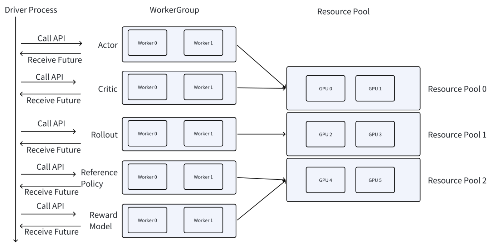

# Verl 

verl is an open source implementation of the paper [HybridFlow](https://arxiv.org/abs/2409.19256v2) and [code](https://github.com/volcengine/verl). verl is a flexible and efficient RLHF library for LLMs.

verl represents RLHF as a dataflow graph. Take the PPO algorithm as an example, the dataflow graph is shown in the following figure.

## RL basic concepts

### Rejection Sampling

### On-policy and online
- **On-policy** emphasizes that the current RL training data must be generated in real-time by the *latest policy model*. Sometimes, a large amount of experience data is pre-sampled and then updated in mini-batches. In this scenario, *only the first mini-batch is on-policy*; the subsequent mini-batches are actually off-policy.

- **Online** emphasis is on whether the current strategy model can *interact with the environment* (for example, when encountering a new batch of mathematical problems, whether it can receive real-time feedback on correctness after completion). In some other scenarios (such as GUI agents, autonomous driving), online interaction necessitates the construction of a complex simulator.

### Off-policy and offline
- **Off-policy**: the policy is updated based on the samples collected from the previous policy.
- **Offline**: emphasis is on whether the current strategy model can interact with the environment (for example, when encountering a new batch of mathematical problems, whether it can receive real-time feedback on correctness after completion). In some other scenarios (such as GUI agents, autonomous driving), online interaction necessitates the construction of a complex simulator.


## PPO RLHF Algorithm

Proximal Policy Optimization (PPO) is a popular RL algorithm for training policy networks. Specifically, PPO can be described as three steps:
1. **Rollout and Evaluation**:
    - Rollout: Actor, Batched prompt
    - Evaluation: Critic, Batched response
2. **Make Experience**:
    - Old Policy sampling: Reference model, actor, batched prompt and response, critic model
    - KL penalty: reward, reference logprobs, old logprobs
    - Generalized advantage estimation: Token reward(from KL penalty), old value(from critic)
3. **Optimization**:
    - New Policy sampling: Actor, critic
    - Update: Critic loss, actor loss

Here is the PPO training procedure ([reference](https://zhuanlan.zhihu.com/p/635757674)):

<div align="center">

</div>

## verl source code analysis

### Overall execution flow

Features:
- *Single contorller* runs on a single process.
- *Multiple workers* run on multiple processes.
- *Resource Pool* provides resources for workers.

<div align="center">

</div>

### entry point: verl/trainer/main_ppo.py
```python
def run_ppo(config) -> None:
    if not ray.is_initialized():
        # this is for local ray cluster
        ray.init(
            runtime_env={"env_vars": {"TOKENIZERS_PARALLELISM": "true", "NCCL_DEBUG": "WARN", "VLLM_LOGGING_LEVEL": "WARN"}},
            # num_cpus=config.ray_init.num_cpus, # here may be a potential bug, the program will stuck here if the num_cpus is not set.
            num_cpus=8, # I changed to 8.
        )

    runner = TaskRunner.remote() # make TaskRunner object
    ray.get(runner.run.remote(config)) # runner.run() is the entry point of the program.
```

Before we start to the verl code, we need to get familiar with basic concepts of the Ray framework. [Ray framework](#ray-framework)

So the entry point is the `run()` method of the `TaskRunner` class.

### TaskRunner

```python
def run(self, config):
    # initiallize the config from command and config file under verl/trainer/config/*
    # download checkpoint from huggingface
    # inistantiate tokenizer and processor(for moltimodal LLM)
    # define worker classes
```


## Ray framework

### Basic concepts of Ray framework

- **Ray Actor**: A remote computation *task with a state*. A Ray Actor is a class that can be instantiated and run on a Ray cluster. It is a lightweight process that can be used to run a single task. Note: This is different from the Actor in Actor-Critic algorithms.

- **Ray Task**: A *stateless* remote computation task. A Ray Task is a function decorated with `@ray.remote`. Local variables created within a task are only visible to that task and not accessible to the task submitter, making it effectively stateless.

- **Resource Management**: Ray automatically manages the allocation of CPU, GPU, and memory resources. You can *specify required computing resources* for Ray actors through the `@ray.remote` decorator or launch options. Additionally, Ray supports placement groups, allowing you to specify whether different Ray actors should be placed in the same or different resource locations (bundles).

- **Hybrid Engine**: Through Ray, verl can easily implement various roles and parallel strategies for resource allocation, including hybrid engine and other co-location strategies.

- **Asynchronous Execution**: Ray computations are *asynchronous*. When executing a Ray computation task, Ray immediately returns a task execution handle (Object reference). The user's code doesn't block and can use `ray.get/ray.wait` to retrieve results in a blocking or polling manner.

Note: In RL training, introducing asynchronous concepts can help overlap processing times between actor/critic/generator/rm components (e.g., while the actor is updating the previous batch, the generator can already generate the next batch). **Since O1-like RL's main time bottleneck is in the rollout position, better async optimization of rollout (e.g., fully utilizing the idle time of online serving clusters at night) is one of the future directions for RL infrastructure optimization.**

### Quick start
Import Ray and and initialize it with `ray.init()`. 

Then decorate the function with `@ray.remote` to declare that you want to run this function remotely. Lastly, call the function with `.remote()` instead of calling it normally. This remote call yields a future, a Ray object reference, that you can then fetch with `ray.get`.
```python
import ray
ray.init() # initialize Ray

@ray.remote
def f(x):
    return x * x

futures = [f.remote(i) for i in range(4)]
print(ray.get(futures)) # [0, 1, 4, 9]

@ray.remote
class Counter(object):
    def __init__(self):
        self.n = 0

    def increment(self):
        self.n += 1

    def read(self):
        return self.n

counters = [Counter.remote() for i in range(4)]
[c.increment.remote() for c in counters]
futures = [c.read.remote() for c in counters]
print(ray.get(futures)) # [1, 1, 1, 1]
```

## Debug Ray
- Ray Distributed Debugger VSCode Extension
- Prerequisites:
    - ray[default] >= 2.9.1
    - debugpy >= 1.8.0
- Environment variables:
    ```bash
    export RAY_DEBUG_POST_MORTEM=1
    ```
- Configuring BreakpointsSet up `breakpoint()` in your code, and submit job to cluster. Then the extension will show the breakpoint information.
    - Insert `breakpoint()` calls into your remote functions.
    - Submit your job to the cluster.
- Run your job directly from command line(do not use a `launch.json`)
- Once the process hits the first `breakpoint()`, click the Ray Distributed Debugger icon in the VSCode sidebar to attach the debugger.
- *Debugging With Multiple breakpoint().* For each subsequent task, first disconnect the current debugger session, then click the extension icon again to attach to the next breakpoint.


## Bugs while running verl

### 1. ray init failed (✅)

```bash
machine: 4 v100 gpus
model: Qwen2.5-0.5B-Instruct
bug line:
    ray.init(
            runtime_env={"env_vars": {"TOKENIZERS_PARALLELISM": "true", "NCCL_DEBUG": "WARN", "VLLM_LOGGING_LEVEL": "WARN"}},
            num_cpus=config.ray_init.num_cpus,
    )
bug: core_worker.cc:513: Failed to register worker to Raylet: IOError: [RayletClient] Unable to register worker with raylet. Failed to read data from the socket: End of file worker_id=01000000ffffffffffffffffffffffffffffffffffffffffffffffff
solution: num_cpus=8 # originally none
```

### 2. torch.cuda function call stuck (❌)
```python
machine: 2 v100 gpus
model: Qwen2.5-0.5B-Instruct
bug: when call function .cuda(), the program will stuck.
solution: I switch to another machine with 4 v100 gpus.
```

### 3. out of memory (❌)
```python
machine: 4 v100 gpus
model: Qwen2.5-0.5B-Instruct
bug: during training, the program terminated with error: may be out of memory.
solution: None.
```

## References

https://zhuanlan.zhihu.com/p/27676081245